# Terraform AWS S3 Bucket for PHI

This module provisions AWS S3 buckets configured to securely store and access
PHI.

## Usage

This module should be used whenever PHI needs to be stored in S3. It provides
sane defaults for secure storage and access in line with customer requirements
for using a HIPAA eligible service in a HIPAA controlled environment. Some of
the defaults can be overridden for convenience or to add more protections. The
bucket can also be used as a CloudFront origing with origin access control
enabled.

### Examples

The following examples assume the module has been installed under a `modules`
directory at the root of the Terraform project. This first example demonstrates
a basic configuration relying on all defaults:

```hcl
module "phi_s3_bucket" {
  source = "./modules/tf-aws-s3-bucket-phi"

  trusted_read_write_arns = [aws_iam_role.phi_read_only.arn]
  trusted_read_only_arns  = [aws_iam_role.phi_read_write.arn]
}
```

The next example sets the S3 bucket as a CloudFront origin. It assumes that the
previous configuration was already applied, so the bucket name exists, which
will prevent a dependency cycle:

```hcl
resource "aws_cloudfront_origin_access_control" "default" {
  name                              = "default-oac"
  origin_access_control_origin_type = "s3"
  signing_behavior                  = "always"
  signing_protocol                  = "sigv4"
}

resource "aws_cloudfront_distribution" "s3_distribution" {
  origin {
    domain_name              = module.phi_s3_bucket.bucket_regional_domain_name
    origin_access_control_id = aws_cloudfront_origin_access_control.default.id
    origin_id                = local.s3_origin_id
  }

  enabled             = true
  default_root_object = "index.html"

  aliases = ["mysite.${local.my_domain}", "yoursite.${local.my_domain}"]

  default_cache_behavior {
    allowed_methods  = ["DELETE", "GET", "HEAD", "OPTIONS", "PATCH", "POST", "PUT"]
    cached_methods   = ["GET", "HEAD"]
    target_origin_id = local.s3_origin_id

    forwarded_values {
      query_string = false

      cookies {
        forward = "none"
      }
    }

    viewer_protocol_policy = "redirect-to-https"
    min_ttl                = 0
    default_ttl            = 3600
    max_ttl                = 86400
  }
}

module "phi_s3_bucket" {
  source = "./modules/tf-aws-s3-bucket-phi"

  trusted_read_write_arns     = [aws_iam_role.phi_read_only.arn]
  trusted_read_only_arns      = [aws_iam_role.phi_read_write.arn]

  cloudfront_distribuiton_arn = aws_cloudfront_distribution.s3_distribution.arn
}
```

This last example expands the previous configuration to override all defaults:

```hcl
module "phi_s3_bucket" {
  source = "./modules/tf-aws-s3-bucket-phi"

  trusted_read_write_arns         = [aws_iam_role.phi_read_only.arn]
  trusted_read_only_arns          = [aws_iam_role.phi_read_write.arn]

  bucket_name_prefix              = "a-meaningful-prefix-"
  cloudfront_distribuiton_arn     = aws_cloudfront_distribution.s3_distribution.arn
  disable_lifecycle_configuration = true
  kms_key_arn                     = aws_kms_key.phi_key.arn
  logging_bucket_id               = aws_s3_bucket.logging.id
  logging_prefix                  = "logs_go_here/"
  object_lock_days                = 2555  # seven years

  tags = {
    "data_classification" = "totally_phi"
    "environment"         = "production"
    "owning_team"         = "connected_care"
  }
}
```

The following architecture digram illustrates how this module (PHI Bucket) could
be integrated into a health record collaboration system (please note that edges
without arrows on either end are used to improve alignment, not to indicate a
relationship):

```mermaid
---
config:
  theme: 'dark'
---
architecture-beta

  group cloud(aws:aws-cloud)
  group account(aws:aws-account) in cloud
  group region(aws:region) in account
  group vpc(aws:virtual-private-cloud-vpc) in region
  group priv(aws:private-subnet)[Private Subnet] in vpc

  service clients(aws:res-users)[Employer Clients]
  service ops(aws:res-users)[SecOps]
  service providers(aws:res-users)[Provider Partners]
  service cdn(aws:arch-amazon-cloudfront)[CDN] in account
  service dns(aws:arch-amazon-route-53)[Alias Record] in account
  service waf(aws:arch-aws-waf)[WAF] in account
  service iam(aws:res-aws-identity-access-management-role)[Provider Role] in account
  service events(aws:arch-amazon-eventbridge)[EventBridge Rules] in region
  service guard(aws:arch-amazon-guardduty)[GuardDuty] in region
  service clientsns(aws:arch-amazon-simple-notification-service)[Reports Topic] in region
  service opssns(aws:arch-amazon-simple-notification-service)[Alerts Topic] in region
  service acm(aws:arch-aws-certificate-manager)[SNI Certificate] in region
  service trail(aws:arch-aws-cloudtrail)[S3 Data Events] in region
  service kms(aws:arch-aws-key-management-service)[CMK] in region
  service secrets(aws:arch-aws-secrets-manager)[Signing Key] in region
  service log(aws:res-amazon-simple-storage-service-general-purpose-bucket)[Logging Bucket] in region
  service phi(aws:res-amazon-simple-storage-service-general-purpose-bucket)[PHI Bucket] in region
  service rot(aws:res-aws-lambda-lambda-function)[Secret Rotation] in region
  service secretsvpc(aws:res-amazon-vpc-endpoints)[Secrets Manager] in priv
  service snsvpc(aws:res-amazon-vpc-endpoints)[SNS] in priv
  service sign(aws:res-aws-lambda-lambda-function)[URL Signer] in priv

  junction clients1 in account
  junction clients2
  junction clients3
  junction cdn1 in region
  junction ops1 in account

  providers:R --> L:iam
  iam:R --> L:phi
  dns:B <--> T:clients
  waf:B <--> T:dns
  cdn:B <--> T:waf
  cdn:R <-- L:cdn1
  phi:B <-- T:cdn1
  cdn1:B <-- T:acm
  log:B <-- T:phi
  phi:R --> L:sign
  secretsvpc:R <-- L:secrets
  secretsvpc:B --> T:sign
  sign:B --> T:snsvpc
  snsvpc:B --> T:clientsns
  secrets:R <-- L:rot
  secrets:B <-- T:kms
  guard:R --> L:events
  trail:B --> T:events
  events:B --> T:opssns
  opssns:B -- T:ops1
  ops1:B --> T:ops
  clientsns:B -- T:clients1
  clients1:B -- T:clients2
  clients3:R -- L:clients2
  clients:R <-- L:clients3
  kms:R -- L:trail
  iam:B -- T:cdn
```



<!-- BEGIN_TF_DOCS -->
## Requirements

No requirements.

## Providers

The following providers are used by this module:

- <a name="provider_aws"></a> [aws](#provider\_aws)

## Modules

No modules.

## Resources

The following resources are used by this module:

- [aws_s3_bucket.s3_bucket](https://registry.terraform.io/providers/hashicorp/aws/latest/docs/resources/s3_bucket) (resource)
- [aws_s3_bucket_lifecycle_configuration.s3_bucket](https://registry.terraform.io/providers/hashicorp/aws/latest/docs/resources/s3_bucket_lifecycle_configuration) (resource)
- [aws_s3_bucket_logging.s3_bucket](https://registry.terraform.io/providers/hashicorp/aws/latest/docs/resources/s3_bucket_logging) (resource)
- [aws_s3_bucket_object_lock_configuration.s3_bucket](https://registry.terraform.io/providers/hashicorp/aws/latest/docs/resources/s3_bucket_object_lock_configuration) (resource)
- [aws_s3_bucket_ownership_controls.s3_bucket](https://registry.terraform.io/providers/hashicorp/aws/latest/docs/resources/s3_bucket_ownership_controls) (resource)
- [aws_s3_bucket_policy.s3_bucket](https://registry.terraform.io/providers/hashicorp/aws/latest/docs/resources/s3_bucket_policy) (resource)
- [aws_s3_bucket_public_access_block.s3_bucket](https://registry.terraform.io/providers/hashicorp/aws/latest/docs/resources/s3_bucket_public_access_block) (resource)
- [aws_s3_bucket_server_side_encryption_configuration.s3_bucket](https://registry.terraform.io/providers/hashicorp/aws/latest/docs/resources/s3_bucket_server_side_encryption_configuration) (resource)
- [aws_s3_bucket_versioning.s3_bucket](https://registry.terraform.io/providers/hashicorp/aws/latest/docs/resources/s3_bucket_versioning) (resource)
- [aws_caller_identity.current](https://registry.terraform.io/providers/hashicorp/aws/latest/docs/data-sources/caller_identity) (data source)
- [aws_iam_policy_document.s3_bucket](https://registry.terraform.io/providers/hashicorp/aws/latest/docs/data-sources/iam_policy_document) (data source)

## Required Inputs

The following input variables are required:

### <a name="input_trusted_read_write_arns"></a> [trusted\_read\_write\_arns](#input\_trusted\_read\_write\_arns)

Description: ARNs of principals that should have read/write access to the bucket. These
entities will have the same limited list and read actions as read-only
principals, and they will have limited write and tagging permissions.

Type: `list(string)`

## Optional Inputs

The following input variables are optional (have default values):

### <a name="input_bucket_name_prefix"></a> [bucket\_name\_prefix](#input\_bucket\_name\_prefix)

Description: Optional prefix for the name of the s3 bucket. Terraform will prefix this
before a procedurally generated ID that has a very high likelihood of being
unique. The provided prefix must follow the requirements of an S3 bucket
name with the additional restriction that it must not exceed 37 characters,
as the ID provided by Terraform consumes 26 of the 63 character limit. The
prefix should end in a non-alphanumeric character to make it easier to
distinguish from the unique ID.

Type: `string`

Default: `"phi-"`

### <a name="input_cloudfront_distribuiton_arn"></a> [cloudfront\_distribuiton\_arn](#input\_cloudfront\_distribuiton\_arn)

Description: ARN of a CloudFront distribution for Origin Access Control. AWS recommends
that OAC be set in the bucket policy before it is applied to the CloudFront
distribution. The documentation does not indicate whether Terraform will
apply the correct order of operations, so this variable may need to be
applied before creating an `aws_cloudfront_origin_access_control` resource.
resource.

Type: `string`

Default: `null`

### <a name="input_disable_lifecycle_configuration"></a> [disable\_lifecycle\_configuration](#input\_disable\_lifecycle\_configuration)

Description: Disable the default lifecycle configuration. If left at the default, this
value allows for a lifecycle configuration with *reasonable* settings for
PHI to be created. Set this to `true` if the lifecycle configuration is not
desired.

Type: `bool`

Default: `false`

### <a name="input_kms_key_arn"></a> [kms\_key\_arn](#input\_kms\_key\_arn)

Description: Optional KMS key ARN. By default, objects added to this bucket will be
encrypted with the AWS KMS service key for S3. Provide the ARN of a customer
managed KMS key if the default key does not meet your requirements.

Type: `string`

Default: `"aws/s3"`

### <a name="input_logging_bucket_id"></a> [logging\_bucket\_id](#input\_logging\_bucket\_id)

Description: Optional name of a logging destination bucket. This should be provided if
server access logs need to be collected for this bucket. The destination
bucket must be in the same account and region where this bucket will be
deployed.

Type: `string`

Default: `null`

### <a name="input_logging_prefix"></a> [logging\_prefix](#input\_logging\_prefix)

Description: Optional prefix for log objects. This is the root prefix of the object key
(path) for objects put into the logging destination bucket.

Type: `string`

Default: `"logs/"`

### <a name="input_object_lock_days"></a> [object\_lock\_days](#input\_object\_lock\_days)

Description: Optional number of days to apply S3 object lock to new objects. Object lock
is disabled by default. Setting this number to a positive value will cause
object lock to be enabled in compliance mode and set to the specified number
of days. Be careful with high values, because objects that have been locked
in compliance mode cannot be removed without closing the owning AWS account
and allowing the suspension period to lapse.

Type: `number`

Default: `0`

### <a name="input_tags"></a> [tags](#input\_tags)

Description: Optional tags to set on the bucket. These will be merged with a set of tags
defined in the module. The modue's default tag values can be overridden by
providing tags with the same keys here.

Type: `map(string)`

Default: `{}`

## Outputs

The following outputs are exported:

### <a name="output_bucket_arn"></a> [bucket\_arn](#output\_bucket\_arn)

Description: Full ARN of the PHI bucket. May be used in IAM permissions policies to grant
access to additional principals in the same account.

### <a name="output_bucket_domain_name"></a> [bucket\_domain\_name](#output\_bucket\_domain\_name)

Description: Regional domain name of the bucket. This should be passed to the CloudFront
origin access config if this bucket will be used as a CloudFront origin.

### <a name="output_bucket_name"></a> [bucket\_name](#output\_bucket\_name)

Description: Name (ID) of the bucket. This can be used when the full ARN is not accepted
as an input.

### <a name="output_bucket_policy"></a> [bucket\_policy](#output\_bucket\_policy)

Description: Bucket policy document JSON. This may be useful in troubleshooting access
issues, especially if there is an issue reading the bucket policy from AWS.
<!-- END_TF_DOCS -->
